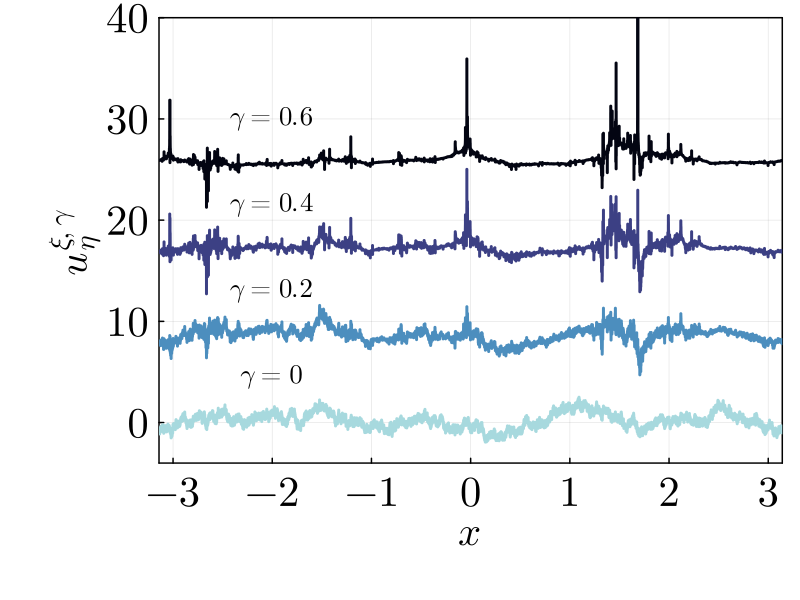

# MultiFractalFields

Package for simulating multifractal random velocity fields according to the Gaussian Multiplicative Chaos Theory.

This Julia package was used to generate the results of [this paper](https://arxiv.org/pdf/2305.09839.pdf).

